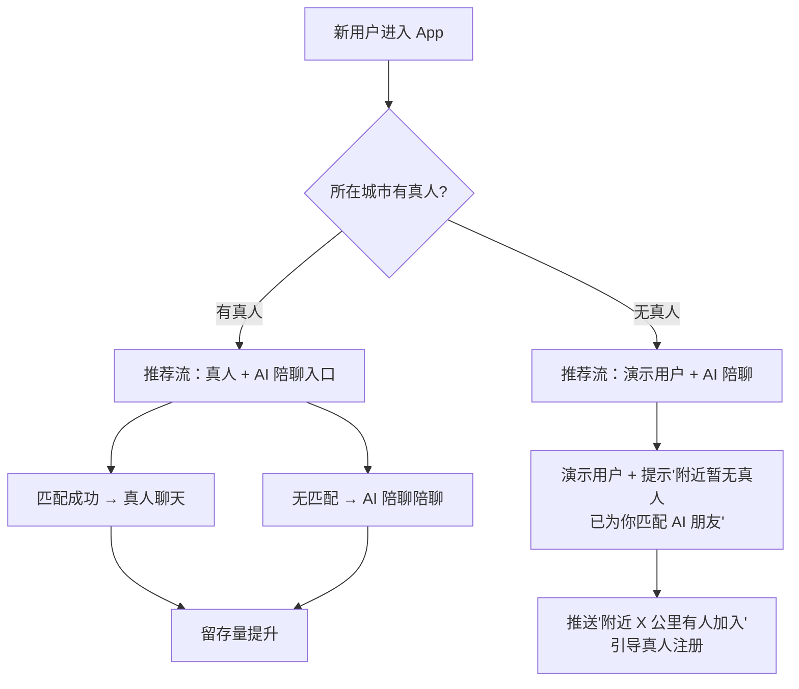
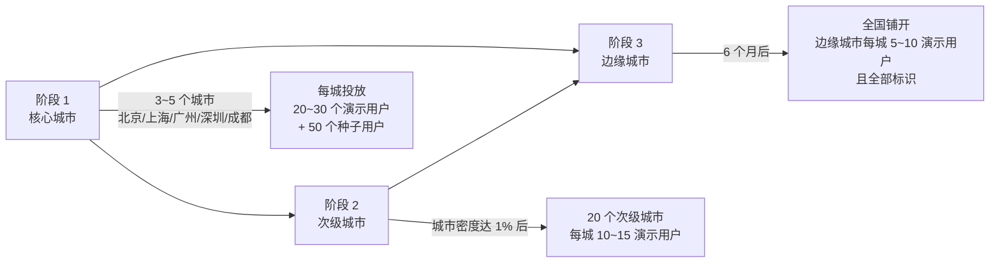

# 遇见冷启动期"虚拟用户"策略报告

> 文档版本：v1.0 · 日期：2026-08-05 · 范围：报告/建议稿（不出代码、不做部署）
> 主题：刚上线用户少，如何用 **合法、诚实、可控** 的方式营造活跃感，留住新用户
> 关联：[monetization-design-2026-08-05.md](./monetization-design-2026-08-05.md)（AI 智能体已在此处铺垫）

---

## 0. 阅读须知：先划清"补位"与"造假"的边界

用户冷启动是每款社交 App 都会遇到的难题，但在动手前必须 **先搞清楚能做与不能做**，否则后面被罚、被骂、被卸载就得不偿失。

| 行为 | 是否可以做 | 原因 |
|---|---|---|
| 用员工/朋友/KOL/校园大使注册真人账户 | ✅ 可以 | 真人、真头像、真行为，符合平台本质 |
| 在空城市放 **明确标识** 的演示用户占位 | ✅ 可以 | 不冒充真人，UI 明确告知"演示用户" |
| 把 AI 聊天做成 **"陪聊功能"**（带 AI 角标） | ✅ 可以 | 2026 年主流方向，《深度合成规定》明确允许，需标识 |
| 用机器人 **主动给真人发消息** | ❌ **不能做** | 干扰真人决策，违反平台诚信原则 |
| 伪造点赞 / 评论 / 礼物数 | ❌ **不能做** | 典型刷数据，App Store / 工信部重点打击 |
| 伪造"XX 正在输入..."假状态 | ❌ **不能做** | 操纵用户心理，已被多国判例认定为不正当竞争 |
| 把演示用户包装成真实用户（不标识） | ❌ **不能做** | 一旦曝光，品牌永久性损失 |
| 伪造 MAU/DAU 给投资人看 | ❌ **不能做** | 涉嫌欺诈，多起上市公司因此被起诉 |

> **底线**：**不冒充真人、不伪造互动、不刷数据**。一旦被发现，所有用户对平台的信任都会崩塌，DAU 永久性腰斩，且不可逆。

---

## 1. 遇见现有 schema 已经具备的"冷启动基础设施"

仓库 `schema.sql` 第 318 行起，已经预留了 10 个虚拟用户：

```sql
-- ============================================================
-- 测试数据：虚拟用户（用于测试推荐功能）
-- ============================================================
INSERT IGNORE INTO users (id, phone, nickname, ...) VALUES
(1001, '13900001001', '甜心小鹿', ...),
(1002, '13900001002', '追风柴犬', ...),
...
(1010, '13900001010', '野生风筝', ...);
```

分布在 **北京 5 个、上海 2 个、广州 1 个、深圳 1 个、杭州 1 个**，覆盖 5 个一线城市，且男女比例、年龄段合理。

**这意味着什么**：
- 冷启动推荐流已经有了"占位"基础
- 推荐算法的冷启动数据已经具备（`user_interest_profiles` 表已就绪）
- 只需把"测试用户"升级为"分层虚拟用户"，即可上线

---

## 2. 三层虚拟用户策略（推荐组合）

最稳妥的做法是 **三层叠加**，不同场景用不同类型，既保证活跃感又不踩红线。



### 2.1 第一层：真人种子用户（最有效、最推荐）

| 项目 | 建议 |
|---|---|
| 数量 | 100~500 个真实账户（≤ 总用户的 5%） |
| 来源 | 团队员工 + 朋友 + 校园大使 + 本地 KOL |
| 头像 | **真人自拍**（禁用网图，肖像权问题） |
| 资料 | 真实年龄、城市、爱好，**不要伪造** |
| 行为 | 每天活跃 30 分钟，与新用户真实聊天（**不能群发**） |
| 身份标识 | 后台 `is_seed=1`，但 **UI 不展示**（保持自然） |
| 退出机制 | 6 个月后转为只读，避免员工离职后产生异常 |

**关键设计点**：
- **不能多**：超过 5% 用户是"内部人"，容易被发现
- **必须真**：聊天内容、行为模式必须真实可识别，**不能套模板**
- **要有反馈**：每天看用户反馈，种子用户被举报要快速处理

### 2.2 第二层：演示用户（占位符，明确标识）

适用于"无用户城市"或"低活跃时段"。

**数据库层**（建议加 4 个字段到 `users` 表）：

```sql
ALTER TABLE users ADD COLUMN is_demo TINYINT(1) DEFAULT 0 COMMENT '是否为演示用户：0-否，1-是';
ALTER TABLE users ADD COLUMN demo_expire_at DATETIME DEFAULT NULL COMMENT '演示用户过期时间';
ALTER TABLE users ADD COLUMN is_seed TINYINT(1) DEFAULT 0 COMMENT '是否为种子用户（仅后台）';
ALTER TABLE users ADD COLUMN is_ai TINYINT(1) DEFAULT 0 COMMENT '是否为AI用户';
ALTER TABLE users ADD COLUMN ai_persona VARCHAR(50) DEFAULT NULL COMMENT 'AI人设：sweet/cute/cool/warm';
```

**产品规则**：
- ✅ 个人主页头像右下角加 **"DEMO"** 角标（颜色醒目）
- ✅ 个人主页顶部展示："这是遇见官方的演示用户，仅供界面预览"
- ✅ 不参与付费、不接收礼物、不出现在真实匹配结果中
- ✅ 仅用于推荐流占位、城市选择页、推荐算法冷启动数据
- ❌ 不允许给真人发消息（即使被对方点赞也不回应）
- ❌ 不出现在"附近的人"、"猜你喜欢"等会触发社交的列表

**当前已有 1001-1010 改造方法**：
```sql
UPDATE users SET is_demo = 1, demo_expire_at = '2026-12-31' WHERE id BETWEEN 1001 AND 1010;
```

### 2.3 第三层：AI 陪聊（功能化，做成付费点）

这是 2026 年最值得做的方向，也是 [monetization-design](./monetization-design-2026-08-05.md) 中 F6 红娘服务的前置。

**形态**：
- 用户注册后自动获得 1 个"AI 朋友"，头像用 AI 生成
- **明显标识**（头像角标"AI"、聊天界面顶部条"你正在和 AI XX 聊天"）
- 能力：基于 LLM 的闲聊、情感陪伴、轻度约会建议

**用户路径**：
- 新用户进入 → 推荐流没匹配 → AI 陪聊主动打招呼 → 引导真人入驻
- "附近暂无真人用户，已为你匹配 AI 朋友 XX，加她聊聊？"

**付费点**（呼应收费报告 A.3.2）：
- AI 朋友创建：¥6 / 月（每个）
- AI 朋友高级人设：¥18 / 月
- 回复次数包：100 次 ¥3 / 500 次 ¥12 / 2000 次 ¥38

**风险控制**：
- 必须明显标识"AI"（《互联网信息服务深度合成管理规定》明确要求）
- 注册时弹窗告知"本平台含 AI 用户"
- 不允许 AI 引导用户付费 / 加微信 / 转账
- 任何"加好友"、"送礼物"按钮对 AI 用户 **永远禁用**

---

## 3. 城市冷启动：分批上线（不要"全国铺开"）

**最常见的错误**：一上线就全国 300+ 城市可注册，结果每个城市都只有 10 个人，反而更冷清。

**正确做法**：



**阶段 1 启动清单（核心城市）**：
- 投放 20~30 个演示用户 / 城市（**明确标识**）
- 投放 50 个真人种子用户 / 城市
- 招募 10~20 个校园大使 / 城市
- 与本地 KOL 合作（小红书 / 抖音探店达人）

**阶段 2 触发条件**：
- 核心城市 DAU 达到 5% 渗透率
- 真人匹配成功率 ≥ 30%
- 7 日留存 ≥ 40%

**阶段 3 边缘城市策略**：
- 边缘城市可开放"AI 陪聊优先"模式
- 城市选择页显示"附近 0 人，已为你匹配 AI 朋友"
- 推送："XX 城市已开放，邀你抢先体验"（邀请真人入驻）

---

## 4. "活跃感"的营造清单：能做 vs 不能做

### 4.1 ✅ 可以做（合规且有效）

| 策略 | 实现方式 | 效果 |
|---|---|---|
| **真实新用户提醒** | "今日 12 位新用户加入你的城市" | 让用户感觉"这地方活跃" |
| **官方动态** | 系统账号发布"遇见日报"、"城市热门话题" | 动态广场不空白 |
| **活动倒计时** | "七夕告白季 · 还剩 3 天" | 制造紧迫感 |
| **真实排行榜** | "今日礼物榜 TOP 10"、"本周心动榜" | 用真实数据，不造假 |
| **AI 陪聊主动破冰** | AI 主动打招呼，引导用户使用 | 给新用户"第一个聊天的对象" |
| **历史聊天回放** | "上次你和 XX 聊到 XX，下次继续？" | 拉回沉默用户 |
| **同城事件** | "你所在的城市今天有 X 人发布了新动态" | 真实数据 |

### 4.2 ❌ 绝对不能做（一旦发现必死）

| 行为 | 后果 |
|---|---|
| 机器人主动给真人发消息 | 违反《个人信息保护法》第 24 条 |
| 伪造"XX 正在输入..." | 操纵用户心理，构成不正当竞争 |
| 伪造点赞数 / 评论数 / 粉丝数 | App Store 4.2 重点审查项，直接下架 |
| 伪造礼物收入 / 守护人数 | 财务造假，涉嫌欺诈 |
| 把 AI 包装成真人 | 违反《深度合成管理规定》 |
| 同一用户多账号互刷 | 数据污染，影响算法决策 |
| 伪造 MAU/DAU 给投资人 | 多家上市公司因此被起诉 |

---

## 5. 已有功能"二次利用"做活跃感（0 改造成本）

仓库里已经有一些功能，稍加配置就能营造活跃感：

| 现有功能 | 二次利用方式 | 工作量 |
|---|---|---|
| `posts`（动态） | 系统账号每天发 1~2 条"遇见日报" | 半天 |
| `community`（社区） | 运营手动创建 5~10 个官方话题 | 1 天 |
| `user_views`（访客） | 真人种子用户每天访问 5~10 个新用户 | 配置即可 |
| `daily_checkins`（签到） | 演示用户也参与签到，营造"大家都来"氛围 | 配置即可 |
| `noble_levels`（贵族） | 演示用户不要给贵族等级，保持"普通人" | 配置即可 |
| 推送系统 | 新用户注册后 1h / 24h / 72h 推送"激活提醒" | 1 周 |

---

## 6. 数据埋点建议

新增埋点事件（用于后续 A/B 和效果评估）：

| 事件名 | 触发时机 | 关键参数 |
|---|---|---|
| `demo_user_view` | 演示用户曝光 | demo_id, city, source |
| `demo_user_click` | 用户点击演示用户 | demo_id, user_id |
| `demo_to_real` | 演示用户引导真人注册转化 | demo_id, new_user_id |
| `ai_chat_start` | AI 陪聊会话开始 | ai_persona, user_id |
| `ai_chat_msg` | AI 陪聊消息 | msg_count, duration |
| `seed_user_active` | 种子用户日活 | seed_id, city |
| `cold_start_match` | 冷启动匹配成功 | user_id, matched_id, matched_type |
| `cold_start_first_chat` | 冷启动首次聊天 | user_id, target_id, target_type |

新增统计指标：
- **演示用户曝光率**：演示用户被浏览 / 总浏览
- **演示 → 真人转化率**：看过演示用户后注册真人用户比例
- **AI 陪聊渗透率**：使用 AI 陪聊 / 总用户
- **种子用户日活率**：种子用户日活 / 种子用户总数
- **新用户 1h 匹配率**：注册后 1h 内产生过互动 / 总新用户

---

## 7. 给遇见的三阶段落地建议

### 7.1 第一周：基础铺垫

1. **数据改造**：给 `users` 表加 `is_demo` / `is_seed` / `is_ai` / `demo_expire_at` / `ai_persona` 字段
2. **现有演示用户升级**：1001-1010 全部置 `is_demo=1`，加角标
3. **数据库清理**：删除测试用户的"敏感信息"（手机号改为虚拟号）
4. **法务 review**：弹窗文案 + 用户协议 + 隐私政策（明确告知"含 AI 用户"）
5. **埋点框架**：埋点 8 个新事件到 `push_logs` 或新表

### 7.2 第一月：核心功能上线

1. **校园大使计划**：招募 50~100 名大学生，每人拉 10~20 个真实用户
2. **本地 KOL 合作**：与 10~20 个本地探店 / 情感博主合作推广
3. **AI 陪聊 MVP**：先用豆包 / GPT 实现基础闲聊，**带 AI 角标**
4. **城市分级**：核心 5 城市 + 次级 20 城市 + 边缘 50 城市
5. **活跃感配置**：动态、推送、排行榜 全部走真实数据
6. **运营日报**：每天看新用户转化、1h 匹配率、7 日留存

### 7.3 第三月：规模化与变现

1. **AI 陪聊付费化**：呼应 [monetization-design A.3.2](./monetization-design-2026-08-05.md)
2. **校园大使分成**：邀请返佣（呼应收费报告 A.2.4）
3. **城市运营**：边缘城市"AI 优先"模式，核心城市"真人优先"
4. **数据看板**：实时监控演示用户、AI 用户、真人用户的活跃比例
5. **法务审计**：第三方合规审计（每季度 1 次）

---

## 8. 风险清单

| 风险 | 概率 | 影响 | 缓解措施 |
|---|---|---|---|
| 演示用户被误认为真人 | 高 | 信任崩塌 | 所有 UI 角标 + 注册协议告知 |
| AI 用户诱导真人转账/加微信 | 中 | 法务风险 | AI 关键词过滤 + 行为监控 + 举报通道 |
| 用户举报"全是机器人" | 中 | 口碑下滑 | 严格控制演示用户 ≤ 10%，真人 ≥ 90% |
| 法务：《深度合成规定》违规 | 中 | 下架风险 | 注册即弹窗 + 全局 AI 标识 |
| 种子用户离职产生异常 | 低 | 数据污染 | 6 个月后转只读 + 离职即冻结 |
| 城市冷启动失败 | 中 | 留存差 | 演示用户带"附近用户"标签 + 推送引导 |
| AI 陪聊产生不当内容 | 中 | 平台风险 | LLM 内容过滤 + 关键词黑名单 |
| 投资人 / 媒体质疑"造假" | 低 | 信誉损失 | 公开说明"AI 陪聊是功能不是造假" |

---

## 9. 衡量"冷启动成功"的关键指标

| 指标 | 定义 | 目标 |
|---|---|---|
| 新用户 1h 匹配率 | 注册后 1h 内产生互动 / 总新用户 | ≥ 60% |
| 新用户 1h 匹配成功率 | 产生真人对真人互动 / 总新用户 | ≥ 30% |
| 7 日留存 | 注册后 7 日仍登录 / 总新用户 | ≥ 40% |
| 演示 → 真人转化率 | 看演示后注册真人 / 看演示用户 | ≥ 5% |
| AI 陪聊 → 真人转化率 | AI 聊天后注册真人 / AI 用户 | ≥ 3% |
| 种子用户日活率 | 种子用户日活 / 种子用户总数 | ≥ 70% |
| 城市覆盖率 | 真人用户数 ≥ 100 的城市数 / 总城市数 | 1 月 ≥ 5，3 月 ≥ 20 |
| 演示用户占比 | 演示用户 / 总用户 | ≤ 10% |
| AI 用户占比 | AI 用户产生的对话 / 总对话 | ≤ 20%（仅冷启动期） |

---

## 10. 一句话总结

**冷启动的本质不是"造假"，是"补位"**：

- **真人种子** → 给新用户真实的"第一个匹配"（最有效，但要做透）
- **演示用户** → 让空城市不尴尬（**必须明确标识**）
- **AI 陪聊** → 让新用户不孤独（**做成付费功能**）
- **不冒充、不造假、不刷数据** —— 这是底线

> 一旦用户发现平台在"假装"，所有信任都会清零。所以**宁可冷启动慢一点，也要把"补位"做诚实的**。

# === 文档结束 ===